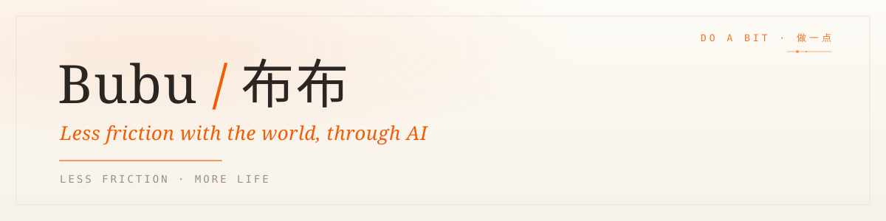

I'm an **AI-native independent developer** — and a CS PhD. I build open-source projects and products that help people work and live a little better with AI, starting with the tools I need myself.

### Find me

 

<i>Just do a bit, every day.</i>
