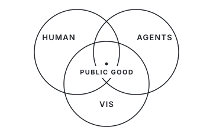

<h1 align="center">blackblue</h1>

<samp>HCI × VISUALIZATION × AI AGENTS</samp>

  CS PhD at Zhejiang University 
  Building tools and community for AI for Public Good.

  <a href="https://doabit.dev">website</a>
  &nbsp;&nbsp;/&nbsp;&nbsp;
  <a href="mailto:yinghaotang@zju.edu.cn">email</a>

  

  <samp>research</samp>&nbsp;&nbsp;
  <a href="https://github.com/MisterBrookT/IGenBench">IGenBench ACL 2026</a>
  &nbsp;/&nbsp;
  <a href="https://github.com/MisterBrookT/paper-skills">paper-skills</a>
    
  <samp>build</samp>&nbsp;&nbsp;
  <a href="https://github.com/MisterBrookT/skill2">skill2</a>
  &nbsp;/&nbsp;
  <a href="https://github.com/MisterBrookT/kaji">kaji</a>
  &nbsp;/&nbsp;
  <a href="https://github.com/MisterBrookT/vividoc">vividoc</a>

